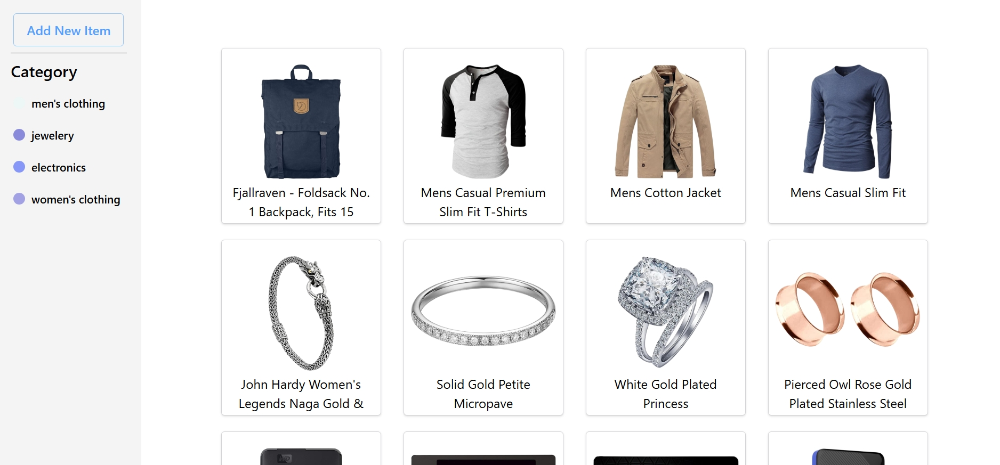
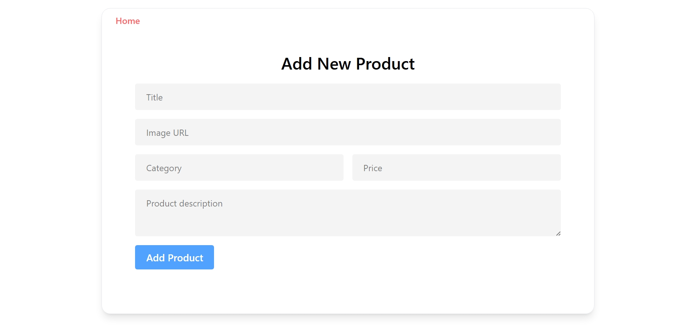
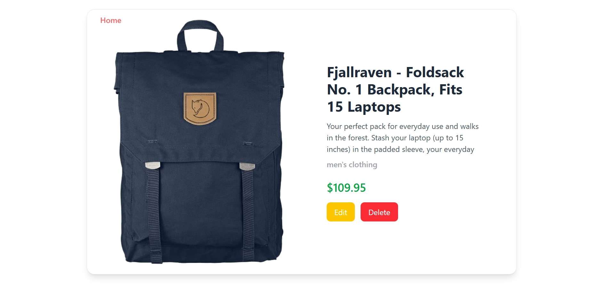

# 🛒 Basic E-Commerce Store

A simple e-commerce application built with **React** and **Fake Store API**.  
It includes categories, product listing, details view, and CRUD operations, with data persistence using **localStorage**.

---

## 📌 Features

- **Product Categories**
  - Men's Fashion
  - Women's Fashion
  - Jewellery
  - Electronics

- **CRUD Functionality**
  - ➕ Add new product
  - ✏️ Update existing product
  - ❌ Delete product
  - 📄 View product details

- **Data Persistence**
  - Products are stored in **localStorage** so they remain after page reload.

- **Category Filtering**
  - Filter products by category from navigation or query parameters.

- **Responsive UI**
  - Designed to work on both desktop and mobile devices.

---

## 🛠 Tech Stack

- **Frontend:** React, React Router DOM, Context API, Tailwind CSS
- **Data Source:** [Fake Store API](https://fakestoreapi.com/)
- **State Management:** React Context API
- **HTTP Requests:** Axios
- **Local Storage:** Browser `localStorage` API

---

## 📂 Folder Structure

```
src
│── Components
│   ├── Nav.jsx
│   ├── Loading.jsx
│   └── ...
│
│── Pages
│   ├── Home.jsx
│   ├── Details.jsx
│   ├── AddProduct.jsx
│   └── ...
│
│── utils
│   ├── Context.jsx
│   ├── Axios.js
│   └── ...
│
│── App.jsx
│── index.js
```

---

## ⚙️ Installation

1. **Clone the repository**
   ```bash
   git clone https://github.com/faizallk/react-projects.git
   cd react-projects/ecommerce-store
   ```

2. **Install dependencies**
   ```bash
   npm install
   ```

3. **Start the development server**
   ```bash
   npm run dev
   ```
   or for CRA:
   ```bash
   npm start
   ```

---

## 🔄 CRUD Operations

- **Read:** Fetches products from Fake Store API (or from localStorage if already saved).
- **Create:** Add product form to insert new items into localStorage.
- **Update:** Edit existing product details and save changes to localStorage.
- **Delete:** Remove a product from localStorage.
- **Filter:** View products by category from navigation links.

---

## 📷 Screenshots





---

## 📌 API Reference

- **Base URL:** `https://fakestoreapi.com/products`
- Example endpoints:
  - `GET /products`
  - `GET /products/category/{category}`
  - `POST /products`
  - `PUT /products/{id}`
  - `DELETE /products/{id}`

---

## 🚀 Future Improvements

- Add authentication (login/signup)
- Cart functionality
- Product search bar
- Backend database integration instead of localStorage

---

## 📜 License

This project is licensed under the **MIT License**.
