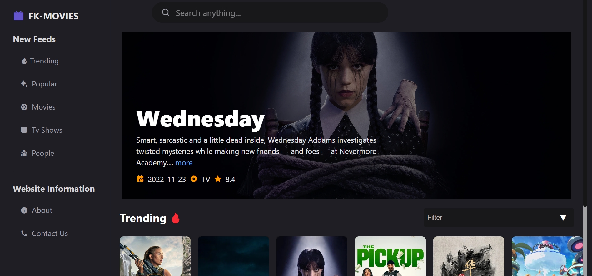
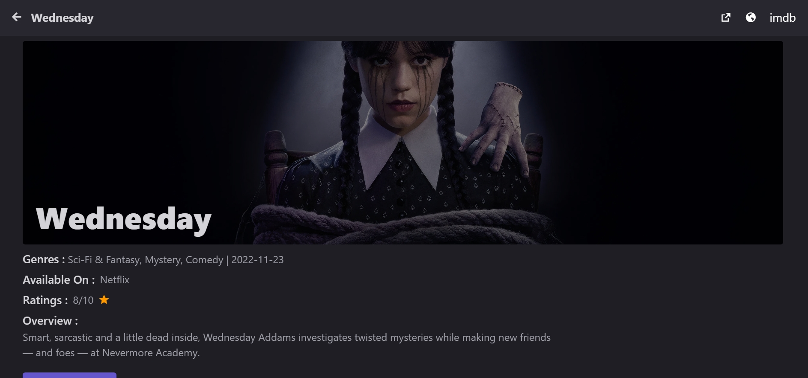
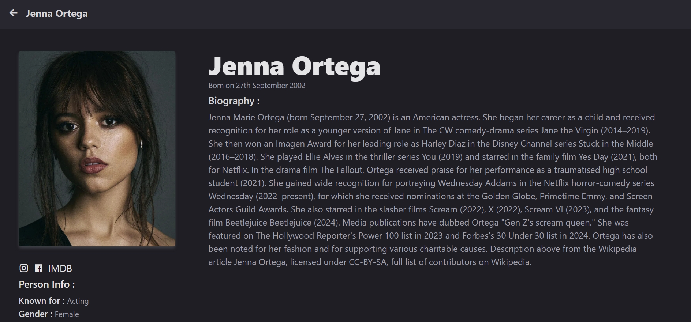
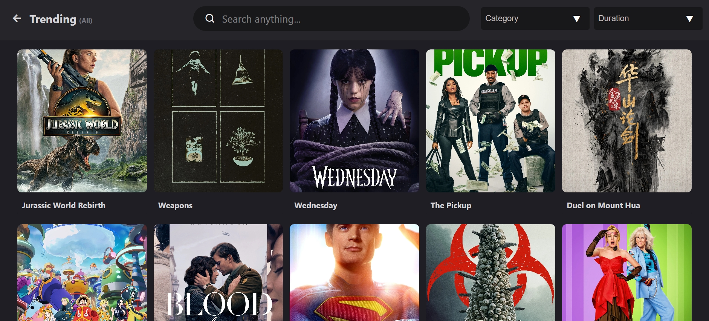

# 🎬 Movie App

A React-based movie and TV show discovery app powered by the [TMDB API](https://www.themoviedb.org/).  
Browse trending movies and TV shows, view detailed information, watch trailers, explore cast and crew, and search for your favorites — all in one place.

---

## ✨ Features

- **Trending Section** – View trending movies and TV shows with a **day/week toggle**.
- **Detailed Pages** for:
  - Movies
  - TV Shows
  - People (Cast/Crew)
- **Embedded Trailers** – Watch YouTube trailers directly in the app using `ReactPlayer`.
- **Search Functionality** – Debounced search for movies, TV shows, and people.
- **External Links** – Direct access to IMDb, Wikipedia, and TMDB pages.
- **Cast & Crew Listings** – Horizontal scrollable cards with images and names.
- **Modern UI** – Styled with Tailwind CSS.
- **Global State Management** – Using Redux Toolkit.
- **API Calls** – Powered by Axios.
- **Secure API Key Handling** – Using `.env` file for TMDB API key.
- **Client-Side Routing** – Using React Router.

---

## 🛠️ Technologies Used

- [React](https://react.dev/) – Frontend library
- [Redux Toolkit](https://redux-toolkit.js.org/) – State management
- [Tailwind CSS](https://tailwindcss.com/) – Styling
- [React Router](https://reactrouter.com/) – Navigation
- [Axios](https://axios-http.com/) – API requests
- [ReactPlayer](https://github.com/cookpete/react-player) – Embedded YouTube player
- [TMDB API](https://developers.themoviedb.org/) – Movie and TV show data
- [Remix Icon](https://remixicon.com/) – Icons

---

## 🚀 Setup Instructions

1. **Clone the Repository**
   ```bash
   git clone https://github.com/faizallk/react-projects.git
   cd react-projects/movie-app
   ```

2. **Install Dependencies**
   ```bash
   npm install
   ```

3. **Set Up Environment Variables**
   - Create a `.env` file in the root of `movie-app` directory:
     ```bash
     VITE_TMDB_API_KEY=your_tmdb_api_key_here
     ```
   - Get your API key from [TMDB](https://www.themoviedb.org/settings/api).

4. **Run the App**
   ```bash
   npm run dev
   ```
   The app will run locally at:  
   ```
   http://localhost:5173
   ```

---

## 📂 Folder Structure (Simplified)
```
movie-app/
├── public/              # Static assets
├── src/
│   ├── api/             # Axios API config & requests
│   ├── components/      # Reusable UI components
│   ├── features/        # Redux Toolkit slices
│   ├── pages/           # Page components (Home, Details, Search)
│   ├── router/          # React Router setup
│   ├── styles/          # Global styles
│   ├── App.jsx          # Main App component
│   ├── main.jsx         # Entry point
│   └── index.css        # Tailwind base styles
├── .env                 # Environment variables (not committed)
├── package.json
└── tailwind.config.js   # Tailwind configuration
```

---

## 🚀 Live Demo

[View Movie App on Vercel](https://react-projects-jh8ftdwzz-faizals-projects-b2f7688e.vercel.app)


---

## 📸 Screenshots
>
>
>
>

---

## 🚧 Future Improvements

- 📱 Make the UI fully responsive for all screen sizes
- 📄 Add pagination or infinite scroll to search results
- ⭐ Add user watchlist & favorites functionality
- ⚠️ Improve error handling and fallback UI

---

## 🙏 Acknowledgements

- [TMDB API](https://www.themoviedb.org/) – Movie & TV data provider
- [Remix Icon](https://remixicon.com/) – Icon set
- [ReactPlayer](https://github.com/cookpete/react-player) – Video player
- [Tailwind CSS](https://tailwindcss.com/) – Styling
- [Redux Toolkit](https://redux-toolkit.js.org/) – State management

---

## 📄 License

This project is licensed under the [MIT License](LICENSE).
